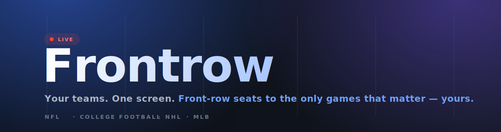

<div align="center">



<br/>

[](https://github.com/germanndarian/frontrow/actions/workflows/ci.yml)
&nbsp;
&nbsp;
&nbsp;
&nbsp;
&nbsp;
&nbsp;

**[Live demo ↗](https://frontrow-ten.vercel.app)** &nbsp;·&nbsp; the only scores, standings and stats that matter — *yours*.

</div>

---

<table>
<tr>
<td width="60%" valign="top">

Most sports apps drown you in every game on earth. **Frontrow** does the opposite:
pick your teams and players once, and get a single, broadcast-grade dashboard that
shows *only* what you follow — live scores, recent form, next fixtures, standings,
and season stats.

Real accounts keep it in sync across devices, and the whole thing is yours to
re-skin. No noise. No clutter. Front-row seats.

</td>
<td width="40%" valign="top">

> **Mood:** a floodlit night game from the press box. Midnight slate,
> broadcast overlays, cobalt as the brand voice, a single live-red pulse,
> amber for the leaders.

</td>
</tr>
</table>

## ✨ Highlights

|  |  |
| --- | --- |
| 🎟️ **A dashboard that's only yours** | No firehose — just live & upcoming, your teams, your players, and the standings around them. |
| 🔴 **Live, but quiet** | Auto-refresh polls *only while a game is actually live.* The rest of the time it's still and fast. |
| 🎨 **Make it yours** | 7 accent themes, corner roundness, density, motion & glow toggles, a custom greeting, default league, and per-section visibility. |
| 🔐 **Real accounts** | Supabase email + password auth with confirmation, Row-Level Security, and cross-device sync. |
| 📊 **Stats with shape** | Season-trend charts, output sparklines, recent form, and league-ranked player numbers. |
| 🌒 **Considered everywhere** | Loading, empty & error states on every surface; mobile-first; honors `prefers-reduced-motion`. |

## 🚀 Quick start

```bash
git clone https://github.com/germanndarian/frontrow.git
cd frontrow
npm install
cp .env.example .env.local     # add the two public Supabase values (below)
npm run dev                     # → http://localhost:3000
```

```bash
npm run build && npm run start  # production build  ·  Node 18.18+ (built on 24)
```

## 🔑 Environment

ESPN needs **no API key** — it's read through keyless public endpoints, server-side.
Accounts need **Supabase**: in production the Vercel integration injects everything;
for local dev, add the two browser-safe values to `.env.local`.

| Variable | Purpose | Required |
| --- | --- | :---: |
| `NEXT_PUBLIC_SUPABASE_URL` | Supabase project URL | ✅ |
| `NEXT_PUBLIC_SUPABASE_ANON_KEY` | Public anon key (RLS-guarded) | ✅ |
| `SUPABASE_SERVICE_ROLE_KEY` | Server-only — account deletion | — |
| `NEXT_PUBLIC_LIVE_POLL_MS` | Live-game refresh cadence | `30000` |
| `NEXT_PUBLIC_USE_MOCK` | Run fully offline on the demo dataset | `false` |

Apply the schema once from [`supabase/migrations/0001_init.sql`](supabase/migrations/0001_init.sql)
(Supabase → SQL Editor) — it creates `profiles` / `preferences` / `settings`,
Row-Level Security so a user only ever touches their own rows, and a trigger that
seeds defaults on signup.

## 🧱 How it works

```
            ┌───────────────┐     ┌─────────────────────┐     ┌──────────────┐
 Browser ──▶│ /api/* handlers│ ──▶ │ ESPN  (cached · 8s   │ ──▶ │  normalizer  │ ──▶ UI
            │   (server)     │     │ timeout · retry-once)│     │ (defensive)  │
            └───────────────┘     └─────────────────────┘     └──────────────┘

 Accounts ─▶ Supabase Auth (cookies · @supabase/ssr) ─▶ Postgres + RLS  ◀─ follows & settings
```

The browser never calls ESPN directly. Each surface is cached server-side
(scoreboard 20s · team/standings/player 5m · teams/rosters 24h) and the client polls
**only while a game is live.** Every normalizer is defensive, so an upstream field
change degrades to a placeholder instead of a crash.

| Route | Source |
| --- | --- |
| `GET /api/scoreboard?leagues=` | `{sport}/{league}/scoreboard` |
| `GET /api/team/[id]?league=` | team detail + `teams/{id}/schedule` |
| `GET /api/standings/[league]` | `v2/.../standings?level=3` |
| `GET /api/player/[id]?league=` | `athletes/{id}` + `athletes/{id}/gamelog` |
| `GET /api/teams` · `/api/roster` | onboarding selectors |
| `GET /auth/confirm` · `DELETE /api/account` | email confirm · account deletion |

## 🛠️ Built with

<div align="center">

`Next.js 16` · `React 19` · `TypeScript` · `Tailwind CSS v4` (OKLCH tokens)
`Supabase` (Auth · Postgres · RLS) · `TanStack Query` · `Zustand` · `Motion` · `Recharts`
`Vitest` · `GitHub Actions` · `Vercel` (Analytics · Speed Insights)

</div>

## 🗂️ Structure

```
src/
  app/
    layout.tsx              Fonts + providers + Analytics / Speed Insights
    page.tsx                Dashboard (auth-gated)
    login/ · setup/         Email auth · four-step onboarding
    settings/               Profile · appearance · dashboard · follows
    auth/confirm/route.ts   Email-confirmation handler
    api/                    ESPN route handlers + /api/account
    globals.css             OKLCH design tokens, base styles, keyframes
  lib/
    supabase/               Browser + server clients (@supabase/ssr)
    auth.ts · sync.ts       Supabase Auth store · follows & settings ⇄ Postgres
    store.ts · settings.ts  In-memory working state (DB-backed)
    espn/                   Server-only ESPN integration
    leagues.ts · types.ts   League config + normalized domain models
  components/               dashboard · setup · ui · system · brand
supabase/migrations/        SQL schema + Row-Level Security
```

## ✅ Quality

`main` is protected — nothing merges red. Every PR runs:

```bash
npm run lint        #  ESLint
npx tsc --noEmit    #  type-check
npm test            #  Vitest
npm run build       #  production build
```

<div align="center">
<br/>

*Frontrow · unofficial data via ESPN's public endpoints, refreshed as games unfold.*

**Built for the only seats worth having — front row.** 🏟️

</div>
